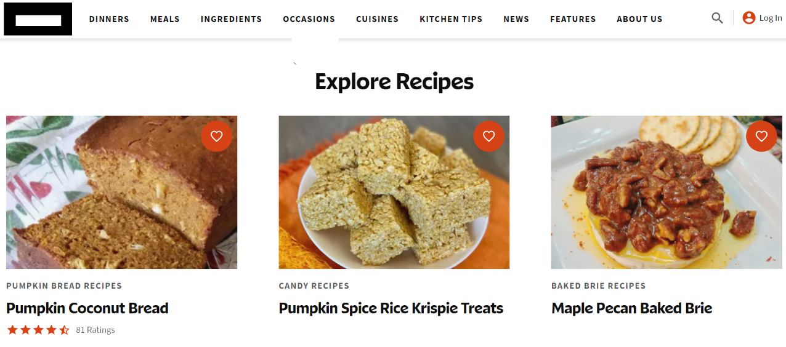

      

      

<html lang="en-US" scroll-behavior="smooth">
    <head>
      <meta charset="UTF-8" />
      <meta http-equiv="X-UA-Compatible" content="IE=edge" />
      <meta name="viewport" content="width=device-width, initial-scale=1" />
  
  <!-- Begin Jekyll SEO tag v2.8.0 -->
  <title>S.M. WEBS</title>
  <meta name="generator" content="Jekyll v3.9.3" />
  <meta property="og:title" content="webs" />
  <meta property="og:locale" content="en_US" />
  <meta name="description" content="JAI SHREE RAM" />
  <meta property="og:description" content="JAI SHREE RAM" />
  <link rel="canonical" href="https://smwebs.github.io/webs/" />
  <meta property="og:url" content="https://smwebs.github.io/webs/" />
  <meta property="og:site_name" content="webs" />
  <meta property="og:type" content="website" />
  <meta name="twitter:card" content="summary" />
  <meta property="twitter:title" content="webs" />
  
  <!-- End Jekyll SEO tag -->
  
      <link rel="stylesheet" href="/webs/assets/css/style.css?v=1c0eed353616d5208dec01e6e89224ea141e810d" />
      <link rel="shortcut icon"  type="image/x-icon" href="">
      <!-- start custom head snippets, customize with your own _includes/head-custom.html file -->
  
  <!-- Setup Google Analytics -->
  
  
  
  <!-- You can set your favicon here -->
  <!-- link rel="shortcut icon" type="image/x-icon" href="/webs/favicon.ico" -->
  
  <!-- end custom head snippets -->
  
    </head>
    <body bgcolor="lightgrey">
      

        
        <h1><a href="https://smwebs.github.io/webs/" style="font-family: 'Courier New', Courier, monospace;font-weight: 900;text-decoration: none;cursor: default;color: black;">THANK YOU FOR VISITING MY WEBSITE!</a></h1>
        <html lang="en" scroll-behavior="smooth">
  <head>
      <meta charset="UTF-8" />
      <meta name="viewport" content="width=device-width, initial-scale=1.0" />
      <title>S.M. WEBS</title>
      <link rel="stylesheet" href="https://cdnjs.cloudflare.com/ajax/libs/font-awesome/6.4.2/css/all.min.css" />
      <link rel="favicon" href="https://cdn-icons-png.flaticon.com/128/3600/3600950.png">
      
  </head>
  <body >
    
        <H1>You are the visitor number:</H1>    
        <!-- hitwebcounter Code START -->
     
       <button onclick="myFunction()" style="color: white;background-color: black;border-radius: 99px;float:right;background-color: black;height: 30px;"><i class="fa-solid fa-cloud-sun fa-xl"></i></button>&nbsp;&nbsp;&nbsp;&nbsp;<button onclick="yourFunction()" style="color: black;background-color: yellow;border-radius: 99px;float: right;height: 30px;"><i class="fa-solid fa-eye-slash fa-xl"></i></button>
      
      

      

      <button style="background-color:lightslategray"><a href="#about" class="a">ABOUT</a></button>
      <button style="background-color:lightslategray"><a href="#business" class="a">BUSINESS</a></button>
      <button style="background-color:lightslategray"><a href="#feedback" class="a">FEEDBACK</a></button>
      <button style="background-color:lightslategray"><a href="#coding" class="a">CODING</a></button>
      <button style="background-color:lightslategray"><a href="#coding" class="a">PROGRAMMING</a></button>
      <button style="background-color:lightslategray"><a href="#ui" class="a">UI</a></button>
      <button style="background-color:lightslategray"><a href="#coding" class="a">SOFTWARES</a></button>
      <button style="background-color:lightslategray"><a href="#about" class="a">YOUNG</a></button>
      <button style="background-color:lightslategray"><a href="#about" class="a">COMPUTER EXPERT</a></button>
      

      

            <a href="#about" style="cursor: pointer;">    <button class="about" style="background-color: transparent;border-color: transparent;font-size: large;
          ;;">About Me</button></a>
          <a href="#business"><button class="about" style="background-color: transparent;border-color: transparent;font-size: large;cursor: pointer;">Business</button></a>
          <a href="#coding"><button class="about" style="background-color: transparent;border-color: transparent;font-size: large;">Coding</button></a>
          <a href="#blog"><button class="about" style="background-color: transparent;border-color: transparent;font-size: large;">Blog</button></a>
          <a href="#blog"><button class="about" style="background-color: transparent;border-color: transparent;font-size: large;">Projects</button>
      
    <marquee width="100%" behavior="alternate" bgcolor="lightyellow" style="text-decoration:underline;border-radius:10px">&gt;--S.M. WEBS--&lt;</marquee>

      
      
<nav class="id">=&gt;Developer  
                      =&gt;Designer
                    
                      =&gt;Coder</nav> 
      

      

      <a href="#home" style="text-decoration: none;color: black;cursor: default;">
      <fieldset style="width: 50px;border-radius: 10px;" class="hover">
      <h1 class="home"><U>Ho</U>me</h1>
      </fieldset>
    </a>
      

           
          <a name="about">
      <h1 align="center" class="h1">|ABOUT||ME|</h1> 
      
I am Shivansh Mishra

          
I am a Computer/Coding expert

          
I am 12yrs old

          
I am from Bihar

          <a name="blog">
          
I am in Class8

              

                  
HOW I DO CODING?(Click)

                   
I am a HTML/CSS programmer.I do coding most likely everyday.Coding is my passion/hobby
 
                   
I use<mark style="color:darkred">Visual Studio Code Editor</mark> for coding
 
                   
I use Windows11 Home for coding

                   

                   

                   

                      <button class="btn">My Blog:</button>  
                                  

                          
I will tell my entire journey of programming in this blog.
                      I started coding in June2023.I want to become a software engineer.I am only 12 year old as you know in my description.As you know that this generation is going towards gaming and devices.So,there are 2 types of people who wants to become a software engineer.
                      First, people who don't know even a single thing about devices and programming but still saying that I want to become a software engineer.(btw I was also like that few months earlier.lol)
                  2nd, people who actually wants to become a software engineer and know most of the things in computer.Many talks about computer is done, let's move on to my blog.In sports I like to play Table-Tennis.
                  I am living in my society since 8 years, but didn't went to play in ground ever and also didn't made any friend.As you know that 2020-2021 was the crucial years for us due to Corona.
                  In 2020 I was in class 5th.So, I was not able to even to walk properly because I was just laying on bed,attending classes and watching TV.I started playing in class 6th
                  around October.Everyone was making jokes on me and I had to handle many humiliations as I was not able to walk and run properly.After 5-6 days, I was sick due to Dengue for 25-30 days and admitted also.After that I stopped playing 
                  with my friends.In 2022 my school was reopened so I get chances to improve my physical fitness.In ending of 2022 I started to playing with my friends.I am writing this blog on <b>3 August 2023</b>
                  and my physical fitness is very good right now:)
<i class="fa-regular fa-face-smile fa-fade fa-2xl"></i>

                       

                   

                   <a name="home">
                     
                    <fieldset class="border-radius">
                    <h1><u>Ho</u>me</h1>
                    
Hello, you have reached my personal website.  
                        I have attempted to make it somewhat disjoint from my “professional”/”academic” website, which is here.
                     
                    I am Shivansh and I am currently enrolled in in middle-school(Class-8th).  
                    I am a software, website and UI developer.
                    I mostly make websites, desktop applications.  
                    I am good in CS & coding.I was good in CS since 5yrs but started coding in 2021.  
                    I was doing well in coding since June,2023.    
                    Also, posted some projects and works on Github.UI projects are also avaliable.  
                    Most difficult projects-   
                    1: My website  
                    2: Electronic Website(name:Storm)
                    

                    

                        <b><u>Follow me on:</u></b>  
                        

                        <i class="fa-brands fa-github fa-2xl"></i>&nbsp;&nbsp;
                        <i class="fa-brands fa-youtube fa-2xl" style="color: red;"></i> 
 
                        <i class="fa-brands fa-whatsapp fa-2xl" style="color: green;"></i>
                        

                </fieldset>
                   

                   <a name="coding">
                   

                   <nav class="nav">
 
                      <h1><u>HTML-CLEARED</u> </h1>
                  

                      <b style="color: aqua;" class="aqua">1:</b>Making Registration Forms  
                     <b class="aqua">2:</b> Making Animations  
                      <b class="aqua">3:</b>Making Dark/Any Color Mode Toggle Button     
                       
                             

</nav> &nbsp;&nbsp;&nbsp;&nbsp;&nbsp;&nbsp;
                   <nav class="nav">
 
                      <h1><u>CSS AND JAVASCRIPT</u> </h1>
                  

                      <b class="aqua">1:</b>All The Properties Of CSS Is Learned  
                      <b class="aqua">2:</b>All The Text Formatting, Graphics, Audio, &amp; Video Elements Is Learned  
                      <b class="aqua">3:</b>Learning Javascript Basics  
                       
                      
                  

                  
</nav> 
                  &nbsp;&nbsp;&nbsp;&nbsp;&nbsp;&nbsp;
                  <nav class="nav">
 
                      <h1><u>MY PROJECTS</u> </h1>
                  

                      <b class="aqua">1:</b>Electric Online Shopping Website  
                      <b class="aqua">2:</b>My Own Website  
                      <b class="aqua">3:</b>Online Grocery Website  
                      <b class="aqua">4:</b>Coding Form  
                        
  
                  

                  
</nav>
                  

                   

                   <nav class="nav2"> 
                      <h1><u><b>What is coding?</b></u></h1>
                       

                      
<b>Coding creates a set of instructions for computers to follow. These instructions determine what actions a computer can and cannot take. Coding allows programmers   to build programs, such as websites and apps.
                          If you have to do coding on the top,   learn "HCJ"(HTML, CSS &amp; JAVASCRIPT).
                      </b>

                   </nav>
                   

                  </a>
                   

                   <a name="ui">
                   

                   

                     
                      <h1><u>UI/UX DESIGNER</u></h1>
                      

                        <b class="aqua">1:</b>I Am Also An UI/UX Designer  
                        <b class="aqua">2:</b>I Have Designed Many UI By Using "Figma"  
                        <b class="aqua">3:</b>Orders Are Also Completed By UI Designing
                      

                      

                

                &nbsp;&nbsp;&nbsp;&nbsp;&nbsp;&nbsp;

                   

                     
                    <h1><u>EXPERIENCE</u></h1>
                    

                        <b class="aqua">1:</b>I Am Designing UI's Since 1.5 Yrs  
                        <b class="aqua">2:</b>Designed UI's Of Many Devices Home Page   
                        <b class="aqua">3:</b>Will Post The Projects Soon
                    
 
                    

                   

                &nbsp;&nbsp;&nbsp;&nbsp;&nbsp;&nbsp;

                   

 
                    <h1><u>MY PROJECTS</u></h1>
                    

                        <b class="aqua">1:</b>My Own Website  
                        <b class="aqua">2:</b>Instagram Login Page  
                        <b class="aqua">3:</b>Windows11 UI  
                        <b class="aqua">4:</b>IPhone 14 Plus UI
                    

                   

                   

                   

                   

                    <nav class="nav2"> 
                       <h1><u><b>What is UI designing?</b></u></h1>
                        

                       
<b>
                        User interface (UI) design is likely the first thing you encounter when you use an application or visit a website. User interface design is responsible for a product's appearance, interactivity, usability, behaviour, and overall feel.

                       </b>

                    </nav>
                    

          </a>
                   

                   

                    <h1>
<u><b>PROJECTS:</b></u>
                    </h1>

                   

                   &nbsp;&nbsp;&nbsp;&nbsp;&nbsp;
                    
                   

                     
                   

                   <a name="business">
                   <fieldset style="border-radius: 80px;border-color:darkblue"><h5 style="text-align: center;text-decoration:underline">|BUSINESS|</h5>
                      <h6>IF YOU NEED ANY PROJECT FEEL FREE TO CALL ON[9773774802]</h6> 
                  <h7 style="text-decoration: underline;cursor:pointer">THE CHARGES ARE:</h7>
                  <ul type="disc">
                      <li>FOR STATIC WEBPAGE:70RS</li>
                      <li>FOR DYNAMIC WEBPAGE:150RS</li>
                          <H8 style="text-decoration:underline;cursor:pointer">THE CONTACT IS:</H8>
                      <ul type="disc">
                          <b><li>9773774802</li></b> 
                          <b><h9>My Youtube Channel:<a href="https://www.youtube.com/channel/UCSjB7NNez6CGy0sdDTV57Bg">https://www.youtube.com/channel/UCSjB7NNez6CGy0sdDTV57Bg</a></h9></b>     
                          
                        <a name="feedback">
    

        
            <ul type="circle" class="p" type="square">
            -Thank you for visiting my website.
             -Please give me a feedback regarding my work, projects and obviously website.  
            -I am making more updates of this website.New updates will come soon.  
            </ul>
        
    

    

                  <h9 style="font-weight: 900;text-decoration:underline;">PLEASE GIVE ME A FEEDBACK</h9>  
                  <form>
                      <input type="radio" value="Yes" class="checkbox" />👍  
                      <input type="radio" value="No" class="checkbox" />👎 
                  </form>
                           
                  <select>
                       
                      <option value="sad">1 STAR</option>
                      <option value="sad">2 STAR</option>
                      <option value="sad">3 STAR</option>
                      <option value="sad">4 STAR</option>
                      <option value="sad">5 STAR</option> 
                  </select>
                  <form> 
                      Feedback: 
                      <input type="text" style="height: 40px;" />  
                      <input type="radio" value="Other" />Other
                   
                       
                      <input type="submit" value="Submit" class="submit" />  
                  </form>
                  <button style="height: 30px;" class="href"><a href="#arrow" style="text-decoration: none;color: #100101;cursor: default;"><i class="fa-solid fa-arrow-up fa-xl"></i></a></button>
  
  
        
      
      
      
    
  
 
  <i class="fa-brands fa-github fa-2xl"></i>
  

  <i class="fa-brands fa-youtube fa-2xl" style="color: red;"></i>
  <i class="fa-brands fa-whatsapp fa-2xl" style="color: green;fill: green;"></i>
  
  
 
  

      
      
      
    
  
  
        
      
      
      
    
  
  
        
      
      
      
    
  
  
        
      

      
      
    
  
